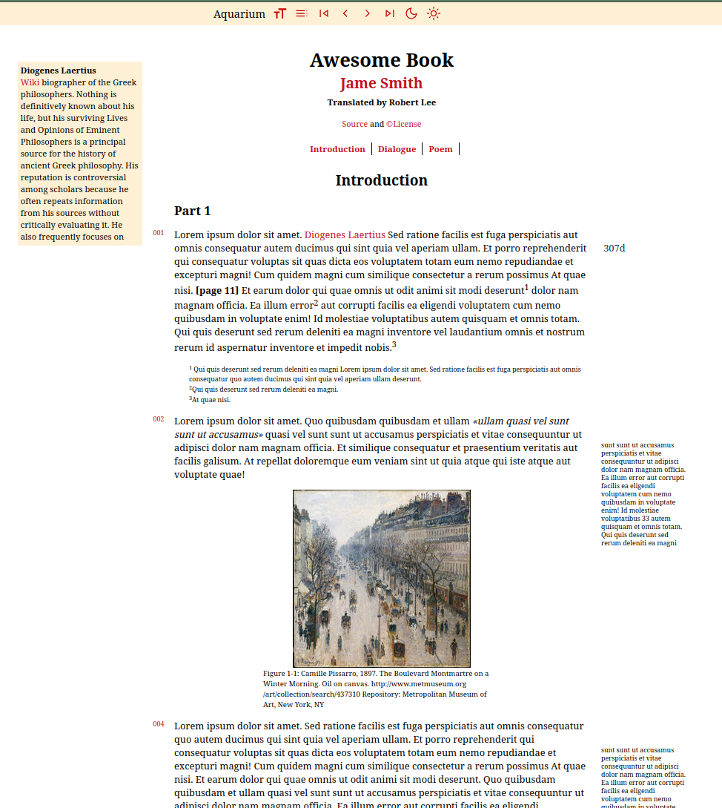

## Academy

Python scripts for converting books from [Project Gutenberg](https://www.gutenberg.org) in html into pretty html reader. The script has been test for Plato, Aristotle and a number of other philosophical works, but will also work for others in the Project Gutenberg library. It will not work for every book.

*Work in Progress**: annotations, images and footnotes and other improvements.

Philosophy books converted using the scripts are available on [insomnicles.github.io/academy](Academy site)

## Requirements

* **Python**: You will need to install [Python 3+](https://www.python.org/)

* **Latex**: "simple" theme will output a latex file 'filename.tex'. To compile the tex document into pdf or ps, you will need [TexLive](https://texlive.org/) under linux, [MikTex](https://miktex.org/) under windows, or some other implementation of latex.

## Usage

The output is either a html file or a latex document. The themes for each are as follows.
- HTML Reader: easy
- Latex Document: simple


You can convert a book from gutenberg directly (1) or from a local file (2). You can also convert an entire directory (3) -- note that the id argument must be supplied but will be ignored in this case. Finally, you can add "--save" or "--savejson" options (4, 5) to save the source file or the extraction to the output directory.

```
    1. python beautify_guttenberg.py 2412 output/test --theme=easy
    2. python beautify_guttenberg.py 2412 output/test --theme=simple --fromlocaldir=src/gutenberg
    3. python beautify_guttenberg.py 2412 output/test --theme=easy --fromlocaldir=src/gutenberg --all
    4. python beautify_guttenberg.py 2412 output/test --theme=easy --save
    5. python beautify_guttenberg.py 2412 output/test --theme=easy --savejson
```

Optionally, you can create jekyll pages from the outputed html pages. Update source and output directories in shell script and then run.
```
    ./create_jekyll_pages
```

## HTML Reader with Easy Theme

The output for "easy" theme is an *html reader*.



## Latex document with Simple Theme

The output for "simple" theme is a *tex document*. You can use PDFLatex or Xelatex.


