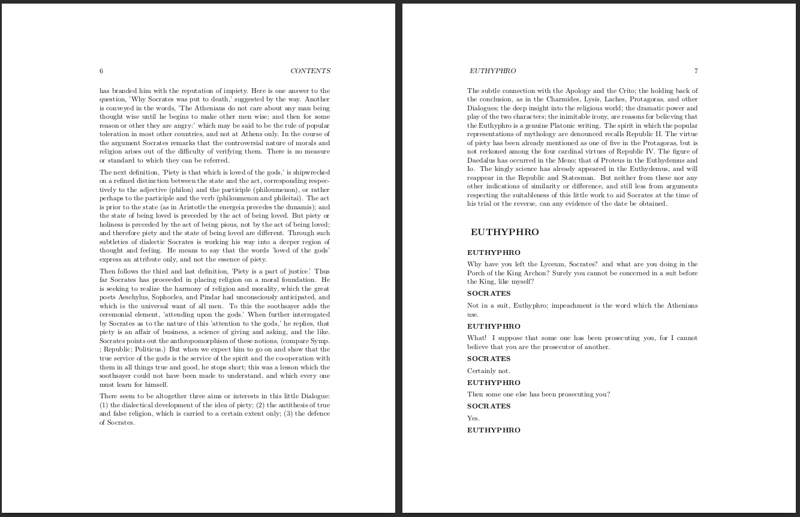

## Academy


Python script for converting books from [Project Gutenberg](https://www.gutenberg.org) into theme-based html reader or LaTex document. The script has been tested for works by Plato and Aristotle. It will work for others but for many it won't due to varying markup.

**Work in Progress**: images, footnotes and sidenotes.

Philosophy books converted using the scripts are available on the [Academy Site](https://insomnicles.github.io/academy)

## Requirements

* **Python**: You will need to install [Python 3+](https://www.python.org/)

* **Latex**: "simple" theme will output a latex file 'filename.tex'. To compile the tex document into pdf or ps, you will need [TexLive](https://texlive.org/) under linux, [MikTex](https://miktex.org/) under windows, or some other implementation of latex. You can use PDFLatex or Xelatex.

## Usage

The output is either a html file or a latex document. The themes for each are as follows.
- HTML Reader: easy
- Latex Document: simple


You can convert a book from gutenberg directly (1) or from a local file (2). You can also convert an entire directory (3) -- note that the id argument must be supplied but will be ignored in this case. Finally, you can add "--save" or "--savejson" options (4, 5) to save the source file or the extraction json file to the output directory.

```
    1. python convert_gutenberg.py 2412 output/test easy
    2. python convert_gutenberg.py 2412 output/test simple --fromlocaldir=src/gutenberg
    3. python convert_gutenberg.py 2412 output/test easy   --fromlocaldir=src/gutenberg --all
    4. python convert_gutenberg.py 2412 output/test simple --save
    5. python convert_gutenberg.py 2412 output/test easy   --savejson
```

To run tests 

```
    python -m unittest discover ../test
```

Optionally, you can create jekyll pages from the outputed html pages. Update source and output directories in shell script and then run.
```
    ./create_jekyll_pages
```

## HTML Reader

### Easy Theme


## Latex Document 

### Simple Theme



