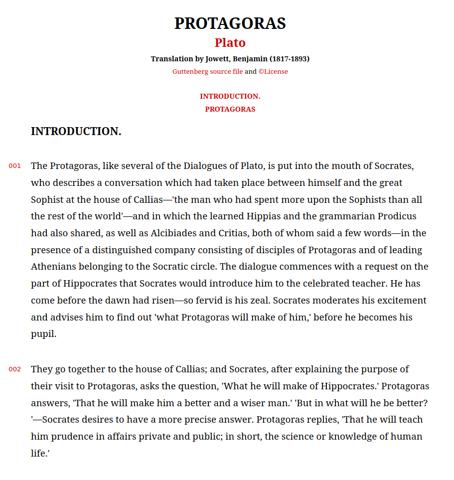

## Academy

Python scripts for converting books from (Project Gutenberg)[https://www.gutenberg.org] in html into pretty html reader.
Right now the scripts are adapted to books by Plato, Aristotle and Greek Tragedians but will also work for others.

## Usage

You will need to install python 3+ if you don't already have it.

Modify html2prettyhtml.py to choose theme, output directory and which works you want to convert. By default, Plato's works are retrieved from Gutenberg.

```
    python html2prettyhtml.py
```

Optionally, you can also create jekyll pages from the converted html pages. Update source and output directories in shell script and then run.
```
    ./create_jekyll_pages
```

## Reader and Themes

The converter converts a book to an html reader with a given theme. The default theme (right now the only one) is "easy" theme.



