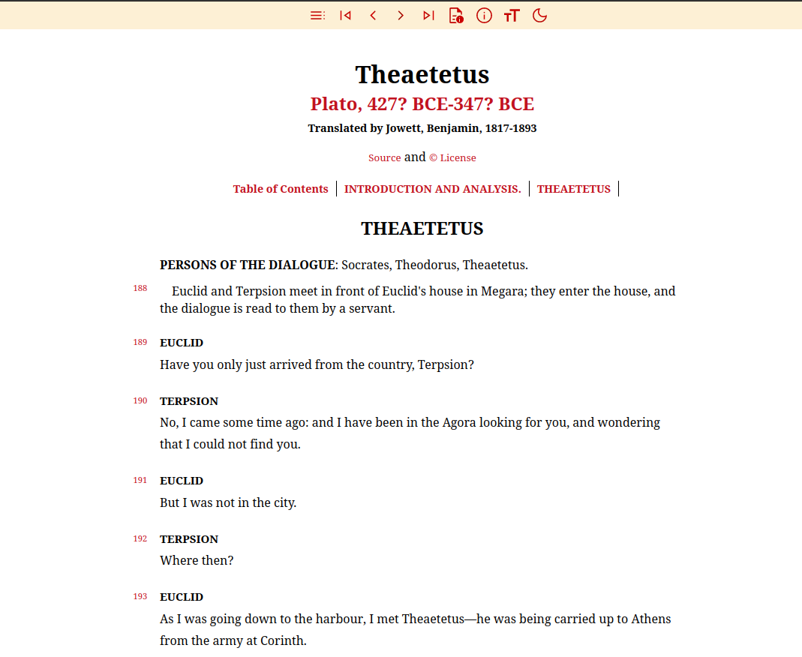
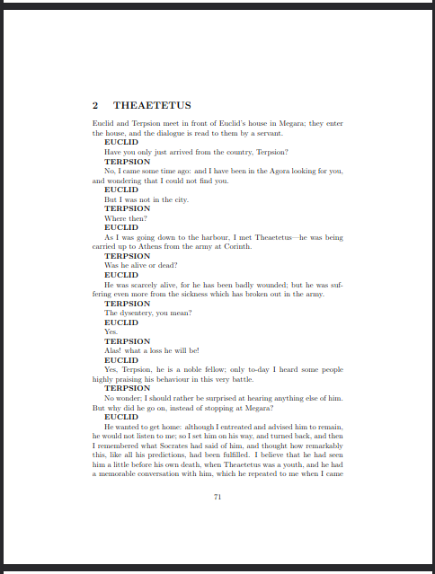

## Academy


Python script for converting books from [Project Gutenberg](https://www.gutenberg.org) into theme-based html reader or LaTex document. The script has been tested for works by Plato and Aristotle. It will work for others but for many it won't due to varying markup.

**Work in Progress**: images, footnotes and sidenotes.

Philosophy books converted using the scripts are available on the [Academy Site](https://insomnicles.github.io/academy)

## Requirements

* **Python**: You will need to install [Python 3+](https://www.python.org/)

* **Latex**: "simple" theme will output a latex file 'filename.tex'. To compile the tex document into pdf or ps, you will need a tex implementation [TexLive](https://texlive.org/) under linux,  [MikTex](https://miktex.org/) under windows, or some other.

## Usage

To use the script you must provide a gutenberg id, a theme and output directory. 

**Themes:** the output file is either a html file or a latex document. The themes for each are as follows. See below how each theme looks.
- HTML Reader: easy
- Latex Document: simple

**Gutenberg Ids:** Gutenberg books are identified by their id, which are in their url and filenames. For example: Hume, Enquiry identified by 9662.

* https://www.gutenberg.org/cache/epub/9662/pg9662-images.html
* https://www.gutenberg.org/ebooks/9662

**Options:** You can convert a book from gutenberg directly (1). Optionally, you can do the same from a local file (2) or an entire local directory (3) -- note that the id argument will be ignored in this case. You can add "--savesrc" or "--savejson" options (4, 5) to save the source file or the extraction json file to the output directory. Finally, you can add "--verbose" or "--debug" (6, 7) options to enable different levels of logging.
```
    cd src
    1. python convert_gutenberg.py 2412 output/test easy
    2. python convert_gutenberg.py 2412 output/test simple --fromlocaldir=src/gutenberg
    3. python convert_gutenberg.py 2412 output/test easy   --fromlocaldir=src/gutenberg --all
    4. python convert_gutenberg.py 2412 output/test simple --savesrc
    5. python convert_gutenberg.py 2412 output/test easy   --savejson
    6. python convert_gutenberg.py 2412 output/test easy   --verbose
    6. python convert_gutenberg.py 2412 output/test simple --savesrc --debug
```

To run tests 

```
    cd src
    python -m unittest discover ../test
```

Optionally, you can create jekyll pages from the outputed html pages. Update source and output directories in shell script and then run.
```
    ./create_jekyll_pages
```

## HTML Reader

### Easy Theme



## Latex Document 

### Simple Theme



